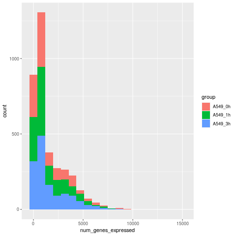

```{r, setup, include=FALSE}
knitr::opts_chunk$set(
  echo = TRUE, warning = FALSE)
```


## Check out dataset
```{r, check-out-cell}
atac_cell <- read.csv("../clean_data/atac_cell_fake_clean.csv", header=TRUE)
head(atac_cell)
cell.row <- nrow(atac_cell)
cell.row
cell.col <- ncol(atac_cell)
cell.col

```
There are `r cell.row` genes in ATAC_cell data set, with `r cell.col` variables measured on each.


## Create a nice looking stratified summary table
```{r, summary-table}
# get summary statistics of number of expressed genes by cell type group
summary_by_group <- by(atac_cell, atac_cell$group, function(x) summary(x$num_genes_expressed))
stratified_summary <- Reduce(rbind, summary_by_group)
row.names(stratified_summary) <- c("A549_0h", "A549_1h", "A549_3h")

# make a nice table of stratified summary table
library(kableExtra)
kable(stratified_summary, "html", caption = "Stratified Summary Table") %>% 
    kable_styling(bootstrap_options = c("striped", "hover", "condensed"),full_width = T, position = "left") %>%
    group_rows("Cell type 1", 1,1) %>%
    group_rows("Cell type 2", 2,2) %>%
    group_rows("Cell type 3", 3,3) %>%
    add_header_above(c(" " = 1,"Number of Expressed Genes"= 6)) 

```
A summary of the number of expressed genes stratified by cell type is shown in the Table above. Cell type 3 (A549_3h) has the largest average amount of expressed genes which is 1724.478. The average number of expressed genes are similar in Cell type 1 (A549_0h) and Cell type 2 (A549_1h).

## Create a nice looking histogram 



A grouped histogram is showed as above. The observations that make up the histogram are grouped according to 'group' variable. The higher number of expressed genes comes from cell type 3 (A549_3h). The number of expressed genes in the three groups was mainly  concentrated in the range of 0 to 10000.

## Create a nice looking density estimate plot 
```{r, density-figure} 


```
According to the density estimate plot, cell type 3 (A549_3h) has more number of expressed genes. The number of genes expressed in Cell type 1 (A549_0h) and Cell type 2 (A549_1h) was small.


## Plot density estimate and histogram together


Overall, the number of expressed genes is concentrated in around 1250.


